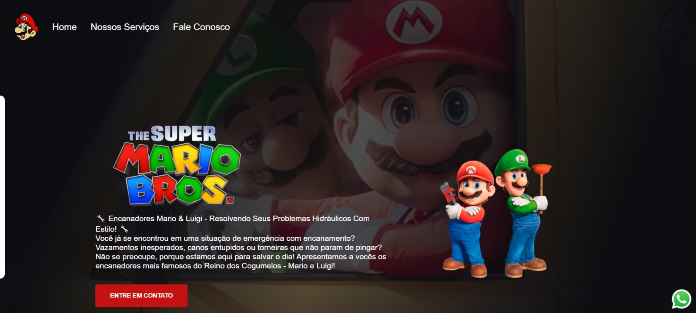
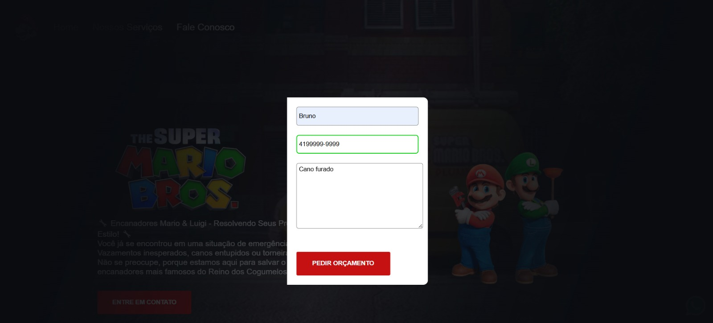
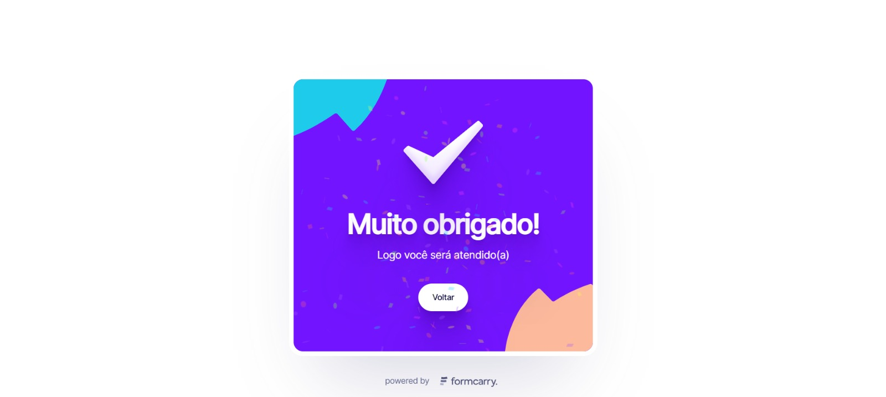
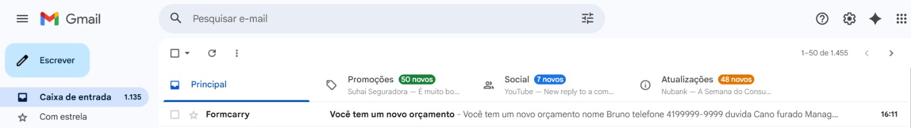

# 🍄 Mario Bros Landing Page

Landing page temática inspirada no universo Mario Bros, desenvolvida com foco em prática de front-end e construção de portfólio.

🔗 Projeto desenvolvido para demonstrar domínio de HTML, CSS e JavaScript, além de integração com serviço externo para envio de formulário.

## 🚀 Funcionalidades

- Layout moderno e responsivo
- Formulário lateral com animação em CSS (efeito hover)
- Integração com API externa (Formcarry) para envio de dados
- Estrutura semântica em HTML5
- Organização de arquivos em boas práticas

## 🛠 Tecnologias Utilizadas

- HTML5
- CSS3
- JavaScript

## 🎯 Objetivo do Projeto

Praticar conceitos fundamentais de desenvolvimento front-end, incluindo:

- Posicionamento com CSS
- Transições e animações
- Manipulação de layout responsivo
- Integração com API externa
- Estruturação de projeto para portfólio

🔗 Acesse o projeto online: https://brunorael.github.io/mario-bros-landing-page/

